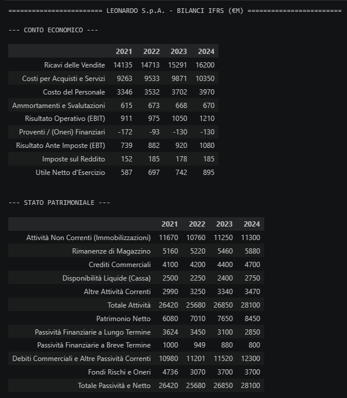
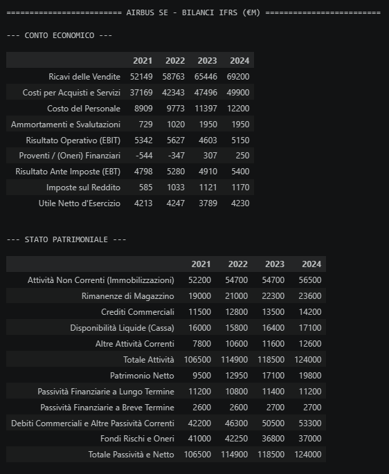
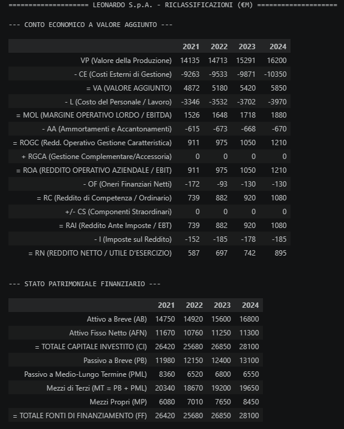
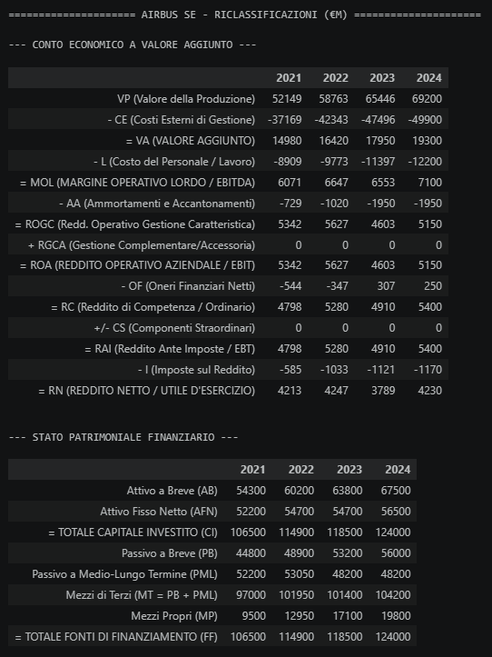
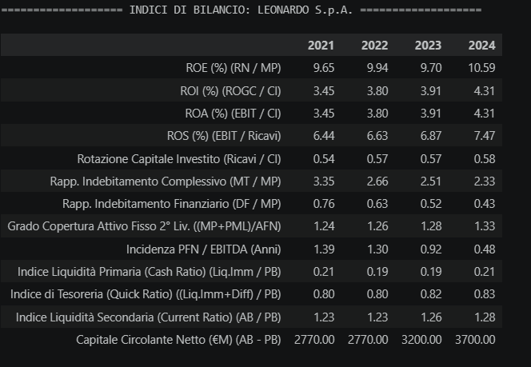
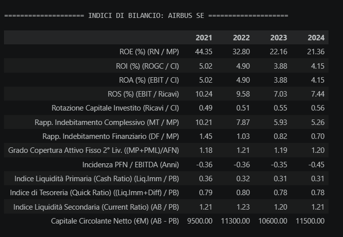
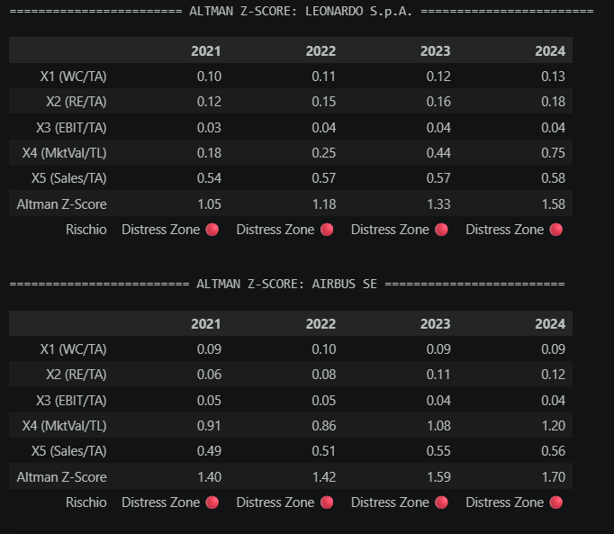
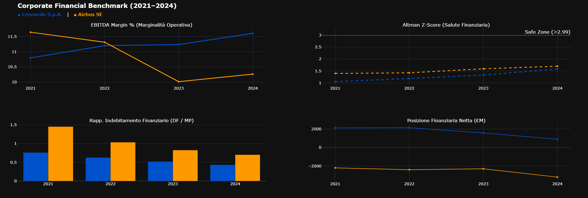

# Corporate Financial Health & Credit Benchmark Analysis: Leonardo S.p.A. vs Airbus SE (2021–2024)

> Quick Links: 🐍 [Python Analysis Notebook](notebooks/financial_analysis.ipynb)

---

## Executive Summary:

Valutare la solidità economico-patrimoniale, la sostenibilità della struttura finanziaria e la vulnerabilità al rischio di default nel settore Aerospazio & Difesa (A&D) è un imperativo strategico per la corporate governance e la valutazione del merito creditizio. Attraverso una pipeline integrata in Python, questo studio conduce un'analisi comparativa tra **Leonardo S.p.A.** e **Airbus SE** lungo l'arco temporale 2021–2024 (4 esercizi), applicando i principi contabili IFRS, la riclassificazione accademica di bilancio, un set completo di 12 indici finanziari e la modellazione predittiva dell'**Altman Z-Score**.

**Key Finding:** Il confronto evidenzia una netta asimmetria strutturale. **Airbus SE** mantiene una posizione di liquidità netta strutturalmente negativa (PFN pari a -3.197 M€ nel 2024, indicativa di cassa eccedente i debiti) e un'incidenza limitata della leva finanziaria (DF/MP a 0,70). Al contrario, **Leonardo S.p.A.**, pur registrando un costante deleveraging (DF/MP sceso da 0,76 a 0,43 e PNF ridotta a 860 M€) e una marginalità operativa superiore (EBITDA Margin all'11,6% vs 10,3% nel 2024), rimane penalizzata sul fronte della solvibilità globale: l'**Altman Z-Score** sale a 1,58 nel 2024 (vs 1,70 di Airbus), mantenendo entrambi i player nella fascia di *Distress Zone* ($Z < 1,81$) a causa dell'elevata intensità di capitale circolante e della leva operativa tipica del settore.

---

## Business Problem:

I team di Corporate Finance, M&A Advisory e Risk Management necessitano di evidenze quantitative per valutare la resilienza operativa e finanziaria delle due principali realtà europee dell'aerospazio a valle degli shock sulle catene di fornitura post-pandemia e nell'attuale scenario di riarmo globale. Le domande di business chiave includono:

1. In che misura la diversa composizione del portafoglio (difesa per Leonardo vs aviazione commerciale per Airbus) impatta su marginalità operativa, rotazione del capitale e flussi di cassa?
2. Quale delle due corporate presenta la struttura patrimoniale più resiliente e il minor rischio di rifinanziamento nel medio-lungo termine?
3. Quali fattori specifici deprimono l'Altman Z-Score delle due società, e quale strategia di capitale circolante o deleveraging può accelerare l'ingresso nella *Grey/Safe Zone*?

---

## Methodology:

### Data Sourcing & Accounting Framework

* **Fonte Dati:** Bilanci Consolidati Ufficiali (Relazioni Finanziarie Annuali 2021–2024) redatti secondo i principi contabili internazionali **IFRS / IAS**.
* **Perimetro di Analisi:** Serie storica quadriennale (2021, 2022, 2023, 2024) per Leonardo S.p.A. (HQ: Roma, Italia) e Airbus SE (HQ: Leida, Paesi Bassi).
* **Accounting Audit & Normalizzazione:**
  * *Verifica Identità Contabile:* Validazione automatica della quadratura di bilancio ($\text{Totale Attivo} = \text{Totale Passivo + Patrimonio Netto}$) per tutti gli 8 rendiconti analizzati.
  * *Riconciliazione IFRS --> Gestionale:* Riclassificazione secondo lo schema accademico funzionale: Stato Patrimoniale a Capitale Investito Netto (CIN) / Finanziario e Conto Economico a Valore della Produzione e Valore Aggiunto.

---

### 1. Bilanci Consolidati Ufficiali IFRS (FY 2021–2024)

Verifica dell'identità contabile: $\text{Totale Attivo} = \text{Totale Passivo} + \text{Patrimonio Netto}$.

| Leonardo S.p.A. (IFRS Grezzo) | Airbus SE (IFRS Grezzo) |
| :---: | :---: |
|  |  |

---

### 2. Riclassificazioni Accademiche (Economia Aziendale 2)

* **Stato Patrimoniale Finanziario & Pertinenza Gestionale:**
  $$\text{CIN} = \text{CCN Operativo} + \text{Attivo Fisso Netto}$$
  $$\text{Copertura CIN} = \text{PFN} + \text{Patrimonio Netto}$$
* **Conto Economico a Valore Aggiunto:**
  $$\text{Valore Aggiunto} \rightarrow \text{MOL (EBITDA)} \rightarrow \text{MON (EBIT)} \rightarrow \text{Utile Netto}$$

| Leonardo S.p.A. (Matrici Riclassificate) | Airbus SE (Matrici Riclassificate) |
| :---: | :---: |
|  |  |

---

### 3. Financial Ratios & Benchmark Computations

Framework di valutazione integrato articolato su 12 indicatori economico-patrimoniali:

* **Redditività & Margini:**
  
  * $\text{ROE} = \frac{\text{Utile Netto}}{\text{Patrimonio Netto}}$ &nbsp;    |    &nbsp; $\text{ROI} = \frac{\text{EBIT}}{\text{Capitale Investito Netto}}$
    
    
  * $\text{ROS} = \frac{\text{EBIT}}{\text{Ricavi}}$ &nbsp;    |    &nbsp; $\text{EBITDA Margin} = \frac{\text{EBITDA}}{\text{Ricavi}}$

    
    
* **Struttura Finanziaria & Solvibilità:**
  
  * $\text{Leva Finanziaria} = \frac{\text{Debiti Finanziari}}{\text{Patrimonio Netto}}$ &nbsp;    |    &nbsp; $\text{PFN} = \text{Debiti Finanziari} - \text{Liquidità}$
    
    
  * $\text{Copertura Oneri} = \frac{\text{EBITDA}}{\text{Oneri Finanziari}}$ &nbsp;    |    &nbsp; $\text{Copertura Attivo Fisso} = \frac{\text{Patrimonio Netto} + \text{Passivo M/L}}{\text{Attivo Fisso Netto}}$

    
    
* **Efficienza & Liquidità Operativa:**
  
  * $\text{Asset Turnover} = \frac{\text{Ricavi}}{\text{Totale Attivo}}$ &nbsp;    |    &nbsp; $\text{Current Ratio} = \frac{\text{Attivo Circolante}}{\text{Passivo Corrente}}$
    
    
  * $\text{Quick Ratio} = \frac{\text{Liquidità + Crediti}}{\text{Passivo Corrente}}$ &nbsp;    |    &nbsp; $\text{Cash Ratio} = \frac{\text{Liquidità Immediate}}{\text{Passivo Corrente}}$

    
    

| Leonardo S.p.A. (Set Ratios) | Airbus SE (Set Ratios) |
| :---: | :---: |
|  |  |

---

### 4. Altman Z-Score Model & Distress Benchmark

* **Formula Altman Z-Score (Manufacturing):**
  $$Z = 1.2X_1 + 1.4X_2 + 3.3X_3 + 0.6X_4 + 0.999X_5$$
  * $X_1 = \text{CCN} / \text{Totale Attivo}$ *(Liquidità netta operativa)*
  * $X_2 = \text{Utili Non Distribuiti (Retained Earnings)} / \text{Totale Attivo}$ *(Capacità di autofinanziamento)*
  * $X_3 = \text{EBIT} / \text{Totale Attivo}$ *(Produttività del capitale investito)*
  * $X_4 = \text{Patrimonio Netto Contabile (Mezzi Propri)} / \text{Totale Passività (Autonomia finanziaria e leva di bilancio)}$ *(Leva di mercato)*
  * $X_5 = \text{Ricavi} / \text{Totale Attivo}$ *(Rotazione degli attivi)*
* **Soglie di Solvibilità:** $Z > 2.99$ (Safe Zone 🟢), $1.81 \le Z \le 2.99$ (Grey Zone 🟡), $Z < 1.81$ (Distress Zone 🔴).

| Altman Z-Score Analysis Matrix (Leonardo vs Airbus) |
| :---: |
|  |

---

### 5. Corporate Benchmark Executive Dashboard

  

---

## Skills:

* **Financial Modeling & Accounting Frameworks:** IFRS/IAS Financial Reporting, Bilanci Consolidati, Riclassificazione Finanziaria e Funzionale, Calcolo Matrici Indici di Bilancio (ROE, ROI, ROS, PFN/EBITDA, ICR), Altman Z-Score Predictive Distress Modeling.
* **Python Data Engineering & Analytics:** `pandas` (ingestione bilanci, manipolazione matriciale e data transformation), `numpy` (vettorizzazione algoritmi e metriche finanziarie).
* **Data Visualization & Dashboard Design:** `plotly.subplots` (architettura visiva 2x2 dark-themed, High Data-Ink Ratio, scale DPI ad alta definizione con `kaleido`), semantic corporate color coding (Leonardo Navy `#0052cc` vs Airbus Orange `#ff9900`).

---

## Results & Business Recommendations:

### 1. Redditività vs Struttura Finanziaria:
* **Efficienza Operativa e Margini:** Leonardo S.p.A. sovraperforma Airbus SE nella marginalità operativa lorda (EBITDA Margin 2024: 11,6% vs 10,3%), beneficiando della spinta della spesa per la difesa governativa. Airbus ha subito una forte compressione nel 2023 (10,0%) legata a colli di bottiglia nelle forniture di aeromobili commerciali, prima di recuperare parzialmente nel 2024.
* **Politica di Deleveraging e Gestione Cassa:** Leonardo ha mostrato una disciplina finanziaria impeccabile, riducendo l'indice di indebitamento finanziario ($\text{DF}/\text{MP}$) dal 0,76 (2021) allo 0,43 (2024) e abbattendo la PFN da oltre 2,1 Mld€ a 860 M€. Airbus opera su un paradigma opposto: una PFN stabilmente negativa (-3,19 Mld€ nel 2024) che garantisce una cassa netta massiccia a protezione da shock esogeni.

### 2. Matrice dei Rischi Strategici:
* **Vulnerabilità Altman Z-Score (Distress Zone):** Entrambi i gruppi restano confinati sotto la soglia di sicurezza di 1,81 (Leonardo a 1,58, Airbus a 1,70 nel 2024). Per Leonardo il punteggio sconta la moderata rotazione dell'attivo (X5) e il rendimento complessivo del capitale investito (X3), tipici delle commesse pluriennali di difesa; per Airbus pesa l'elevata quota di passività totali rispetto al patrimonio netto contabile (X4).
* **Rischio di Tasso e Costo del Debito:** Nonostante la riduzione del debito, Leonardo sostiene un costo del servizio del debito più oneroso rispetto ad Airbus, la quale sfrutta la propria cassa netta per generare proventi finanziari attivi mitigando gli incrementi dei tassi BCE.

### 3. Raccomandazioni Operative per il C-Level:
* **Ottimizzazione del Ciclo di Cassa (Leonardo):** Accelerare le milestone di fatturazione e incasso sui contratti governativi per massimizzare la generazione di cassa operativa (Free Cash Flow), abbattere ulteriormente gli oneri finanziari e accelerare il miglioramento della redditività (X3) e della solidità patrimoniale (X4) verso la *Grey Zone*.
* **Stabilizzazione Supply Chain & Delivery (Airbus):** Standardizzare i cicli produttivi per minimizzare i ritardi di consegna degli aeromobili civili, evitando la volatilità della marginalità operativa registrata tra il 2022 e il 2023.

---

## Next Steps:

### 1. Valutazione Economica dei Rischi e Stress Testing Finanziario

* **Analisi di Sensibilità ai Tassi d'Interesse:** Quantificare l'impatto economico diretto sui flussi di cassa e sulla copertura degli oneri finanziari (Interest Coverage Ratio) di Leonardo simulando scenari di variazione dei tassi BCE ($\pm 50\text{ bps}$, $\pm 100\text{ bps}$).
* **Stress Test su Ritardi di Consegna e Supply Chain:** Stimare l'assorbimento addizionale di cassa e la contrazione dei margini operativi per Airbus a fronte di colli di bottiglia persistenti nella catena di fornitura dei motori e delle aerostrutture commerciali.
* **Simulazione Monte Carlo sui Budget di Difesa:** Modellare la dispersione della crescita dei ricavi e della redditività di Leonardo proiettando la volatilità degli stanziamenti governativi NATO ed europei fino al 2030.

### 2. Piani Operativi per l'Ottimizzazione del Capitale e Ritorno Economico

* **Programma di Riconciliazione e Anticipo CCN (Leonardo):**
  * *Azione:* Rinegoziazione delle milestone di pagamento sui contratti di fornitura per la difesa e cartolarizzazione pro-soluto dei crediti commerciali verso enti governativi.
  * *Beneficio Economico:* Riduzione del capitale circolante investito (CCN), conversione rapida dei crediti in liquidità immediata, taglio degli oneri finanziari e rafforzamento complessivo del profilo Z-Score verso la Grey Zone.
* **Capital Allocation e Ottimizzazione della Liquidità Netta (Airbus):**
  * *Azione:* Allocazione strategica della massiccia cassa netta (oltre 3,1 Mld€) su investimenti diretti in automazione industriale e programmi di riacquisto azioni proprie (share buyback).
  * *Beneficio Economico:* Incremento del ritorno sul capitale investito (ROI) e contestuale mitigazione del rischio di rendimenti reali negativi sulla liquidità inerte.
* **Rifinanziamento del Debito a Condizioni Agevolate (*Sustainability-Linked Bonds*):**
  * *Azione:* Emissione di prestiti obbligazionari corporate legati a target verificabili di decarbonizzazione e standardizzazione ESG nelle filiere produttive A&D.
  * *Beneficio Economico:* Riduzione del costo medio ponderato del debito (risparmio di 15–30 bps sugli spread creditizi) e allungamento della vita media delle passività finanziarie.
* **Integrazione di Modelli Predittivi DCF & Peer Group Espanso:**
  * *Azione:* Sviluppo di moduli analitici automatizzati per il calcolo del Free Cash Flow to Firm (FCFF) ed estensione del benchmark ad altri global player della difesa (Lockheed Martin, BAE Systems, Thales).
  * *Beneficio Economico:* Determinazione del target price e del valore intrinseco fondamentale (Enterprise Value) a supporto di decisioni di M&A e risk advisory.
